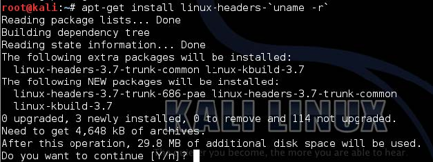

# 第二章 定制 Kali Linux

> 作者：Willie L. Pritchett, David De Smet

> 译者：[飞龙](https://github.com/)

> 协议：[CC BY-NC-SA 4.0](http://creativecommons.org/licenses/by-nc-sa/4.0/)

这一章会向你介绍Kali的定制，便于你更好地利用它。我们会涉及到ATI和英伟达GPU技术的安装和配置，以及后面章节所需的额外工具。基于ATI和英伟达GPU的显卡允许我们使用它们的图像处理单元（GPU）来来执行与CPU截然不同的操作。我们会以ProxyChains的安装和数字信息的加密来结束这一章。

## 2.1 准备内核头文件

有时我们需要使用所需的内核头文件来编译代码。内核头文件是Linux内核的源文件。这个秘籍中，我们解释准备内核头文件所需的步骤，便于以后使用。

### 准备

完成这个秘籍需要网络连接。

### 操作步骤

让我们开始准备内核头文件：

1.  我们首先通过执行下列命令升级发行版作为开始：

    
    
2.  下面，我们需要再次使用`apt-get`来准备内核头文件，执行下列命令：

    ```
    apt-get install linux-headers - `uname –r`
    ```
    
    
    
3.  复制下列目录以及其中的全部内容：

    ```
    cd /usr/src/linux 
    cp -rf include/generated/* include/linux/
    ```
    
4.  我们现在已准备好编译需要内核头文件的代码。

## 2.2 安装 Broadcom 驱动

在这个秘籍中，我们将要安装 Broadcom 官方的Linux混合无线驱动。 使用Broadcom 无线USB适配器可以让我们在Kali上连接我们的无线USB接入点。对于这本书的其余秘籍，我们假设Broadcom 无线驱动已经安装。

### 准备

完成这个秘籍需要网络连接。

### 操作步骤

让我们开始安装 Broadcom 驱动：

1.  打开终端窗口，从[http://www.broadcom.com/support/802.11/linux_sta.php](http://www.broadcom.com/support/802.11/linux_sta.php)下载合适的Broadcom 驱动：

    ```
    cd /tmp/ 
    wget http://www.broadcom.com/docs/linux_sta/hybrid-portsrc_ x86_64-v5_100_82_112.tar.gz
    ```
    
    
    
2.  使用下列命令解压下载的驱动：

    ```
    mkdir broadcom 
    tar xvfz hybrid-portsrc_x86_64-v5_100_82_112.tar.gz –C /tmp/ broadcom
    ```
    
3.  修改`wl_cfg80211.c`文件，由于5.100.82.112版本中有个bug，会阻止小于2.6.39内核版本上的编译：

    ```
    vim /tmp/broadcom/src/wl/sys/wl_cfg80211.c
    ```
    
    观察代码段的1814行：
    
    ```c
    #if LINUX_VERSION_CODE > KERNEL_VERSION(2, 6, 39)
    ```
    
    将其改为：
    
    ```c
    #if LINUX_VERSION_CODE >= KERNEL_VERSION(2, 6, 39) 
    ```
    
    并保存修改。
    
4.  编译代码：

    ```
    make clean
    make
    make install
    ```
    
5.  更新依赖：

    ```
    depmod -a
    ```
    
6.  通过下列命令找到加载的模块：

    ```
    lsmod | grep b43\|ssb\|bcma
    ```
    
7.  通过执行下列命令移除发现的模块：

    ```
    rmmod <module>b43
    ```
    
    其中`<module>`应为`b43`、`ssb`或`bcma`。
    
8.  将模块加入黑名单，防止它们在系统启动中加载：

    ```
    echo "blacklist <module>" >> /etc/modprobe.d/blacklist.conf 
    ```
    
    其中`<module>`应为`b43`、`ssb`或`wl`。
    
9.  最后，将新模块添加到Linux内核中，来使它成为启动进程的一部分：

    ```
    modprobe wl
    ```
