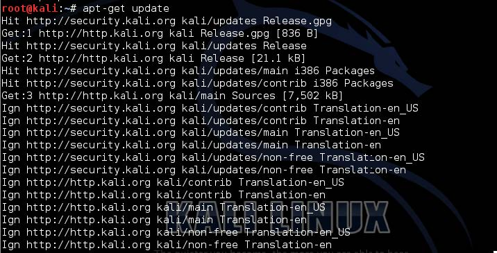
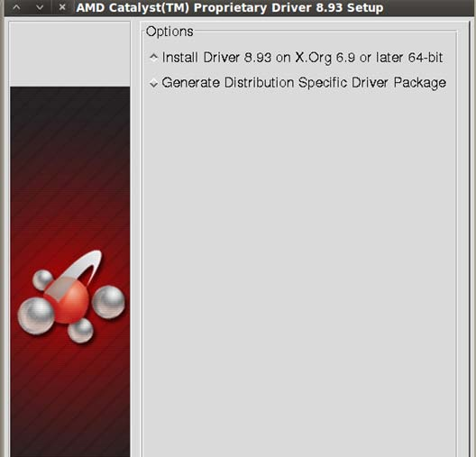

# 第二章 定制 Kali Linux

> 作者：Willie L. Pritchett, David De Smet

> 译者：[飞龙](https://github.com/)

> 协议：[CC BY-NC-SA 4.0](http://creativecommons.org/licenses/by-nc-sa/4.0/)

这一章会向你介绍Kali的定制，便于你更好地利用它。我们会涉及到ATI和英伟达GPU技术的安装和配置，以及后面章节所需的额外工具。基于ATI和英伟达GPU的显卡允许我们使用它们的图像处理单元（GPU）来来执行与CPU截然不同的操作。我们会以ProxyChains的安装和数字信息的加密来结束这一章。

## 2.1 准备内核头文件

有时我们需要使用所需的内核头文件来编译代码。内核头文件是Linux内核的源文件。这个秘籍中，我们解释准备内核头文件所需的步骤，便于以后使用。

### 准备

完成这个秘籍需要网络连接。

### 操作步骤

让我们开始准备内核头文件：

1.  我们首先通过执行下列命令升级发行版作为开始：

    
    
2.  下面，我们需要再次使用`apt-get`来准备内核头文件，执行下列命令：

    ```
    apt-get install linux-headers - `uname –r`
    ```
    
    
    
3.  复制下列目录以及其中的全部内容：

    ```
    cd /usr/src/linux 
    cp -rf include/generated/* include/linux/
    ```
    
4.  我们现在已准备好编译需要内核头文件的代码。

## 2.2 安装 Broadcom 驱动

在这个秘籍中，我们将要安装 Broadcom 官方的Linux混合无线驱动。 使用Broadcom 无线USB适配器可以让我们在Kali上连接我们的无线USB接入点。对于这本书的其余秘籍，我们假设Broadcom 无线驱动已经安装。

### 准备

完成这个秘籍需要网络连接。

### 操作步骤

让我们开始安装 Broadcom 驱动：

1.  打开终端窗口，从[http://www.broadcom.com/support/802.11/linux_sta.php](http://www.broadcom.com/support/802.11/linux_sta.php)下载合适的Broadcom 驱动：

    ```
    cd /tmp/ 
    wget http://www.broadcom.com/docs/linux_sta/hybrid-portsrc_ x86_64-v5_100_82_112.tar.gz
    ```
    
    
    
2.  使用下列命令解压下载的驱动：

    ```
    mkdir broadcom 
    tar xvfz hybrid-portsrc_x86_64-v5_100_82_112.tar.gz –C /tmp/ broadcom
    ```
    
3.  修改`wl_cfg80211.c`文件，由于5.100.82.112版本中有个bug，会阻止小于2.6.39内核版本上的编译：

    ```
    vim /tmp/broadcom/src/wl/sys/wl_cfg80211.c
    ```
    
    观察代码段的1814行：
    
    ```c
    #if LINUX_VERSION_CODE > KERNEL_VERSION(2, 6, 39)
    ```
    
    将其改为：
    
    ```c
    #if LINUX_VERSION_CODE >= KERNEL_VERSION(2, 6, 39) 
    ```
    
    并保存修改。
    
4.  编译代码：

    ```
    make clean
    make
    make install
    ```
    
5.  更新依赖：

    ```
    depmod -a
    ```
    
6.  通过下列命令找到加载的模块：

    ```
    lsmod | grep b43\|ssb\|bcma
    ```
    
7.  通过执行下列命令移除发现的模块：

    ```
    rmmod <module>b43
    ```
    
    其中`<module>`应为`b43`、`ssb`或`bcma`。
    
8.  将模块加入黑名单，防止它们在系统启动中加载：

    ```
    echo "blacklist <module>" >> /etc/modprobe.d/blacklist.conf 
    ```
    
    其中`<module>`应为`b43`、`ssb`或`wl`。
    
9.  最后，将新模块添加到Linux内核中，来使它成为启动进程的一部分：

    ```
    modprobe wl
    ```

## 2.3 安装和配置ATI显卡驱动

这个秘籍中，我们会详细讲解ATI显卡驱动的安装和配置，在此之前需要AMD Accelerated Parallel Processing (APP) SDK、OepnCL和CAL++。我们可以利用 ATI Stream技术的优势来运行计算密集型任务 -- 尤其是运行在CPU上 -- 使他们更快更高效地执行。更多ATI Stream技术相关的详细信息，请访问[www.amd.com/stream]( www.amd.com/stream)。

### 准备

需要网络连接来完成这个秘籍。同时需要在开始这个秘籍之前准备内核头文件，它在上一节有所涉及。

### 操作步骤

让我们开始安装和配置ATI驱动：

1.  下载系统所需的ATI显示驱动：

    ```
    cd /tmp/ 
    wget http://www2.ati.com/drivers/linux/amd-driver-installer-121-x86.x86_64.run
    ```
    
    我们也可以从下面的网址下载显示驱动：[http://support. amd.com/us/gpudownload/Pages/index.aspx](http://support. amd.com/us/gpudownload/Pages/index.aspx)。
    
    
    
2.  通过键入下列命令来开始安装：

    ```
    sh amd-driver-installer-12-1-x86.x86_64.run
    ```
    
    
    
3.  在安装完成之后，重启你的系统来使改变生效，并且避免不稳定。

4.  为之后的步骤安装一些依赖：

    ```
    apt-get install libroot-python-dev libboost-python-dev libboost1.40-all-dev cmake
    ```
    
5.  下载并解压 AMD APP SDK，根据你的CPU架构：

    ```
    wget http://developer.amd.com/Downloads/AMD-APP-SDK-v2.6-lnx64.tgz 
    mkdir AMD-APP-SDK-v2.6-lnx64 
    tar zxvf AMD-APP-SDK-v2.6-lnx64.tgz –C /tmp/AMD-APP-SDK-v2.6-lnx64 
    cd AMD-APP-SDK-v2.6-lnx64
    ```
    
6.  通过下列命令安装AMD APP SDK：

    ```
    sh Install-AMD-APP.sh
    ```
    
7.  在`.bashsrc`文件中设置ATI Stream的路径：

    ```
    echo export ATISTREAMSDKROOT=/opt/AMDAPP/ >> ~/.bashrc 
    source ~/.bashrc
    ```
    
8.  下载并编译`calpp`：

    ```
    cd /tmp/ 
    svn co https://calpp.svn.sourceforge.net/svnroot/calpp calpp 
    cd calpp/trunk 
    cmake . 
    make 
    make install
    ```
    
9.  下载并编译`pyrit`：

    ```
    cd /tmp/ 
    svn co http://pyrit.googlecode.com/svn/trunk/ pyrit_src 
    cd pyrit_src/pyrit 
    python setup.py build 
    python setup.py install
    ```
    
0.  构建并安装OpenCL：

    ```
    cd /tmp/pyrit_src/cpyrit_opencl 
    python setup.py build 
    python setup.py install\
    ```
    
1.  对` cpyrit_calpp `的安装做一些小修改：

    ```
    cd /tmp/pyrit_source/cpyrit_calpp 
    vi setup.py
    ```
    
    找到下面这一行：
    
    ```
    VERSION = '0.4.0-dev' 
    ```
    
    把它改成：
    
    ```
    VERSION = '0.4.1-dev' 
    ```
    
    之后，找到下面这一行：
    
    ```py
    CALPP_INC_DIRS.append(os.path.join(CALPP_INC_DIR, 'include')) 
    ```
    
    把它改成：
    
    ```py
    CALPP_INC_DIRS.append(os.path.join(CALPP_INC_DIR, 'include/CAL'))
    ```
    
2.  最后将ATI GPU模块添加到pyrit：

    ```
    python setup.py build 
    python setup.py install
    ```
    
> 为了展示可用的CAL++设备和CPU的核数，我们需要键入下列命令：

> ```
> pyrit list_cores
> ```

> 为了进行跑分，我们只需要键入：

> ```
> pyrit benchmark
> ```

## 2.4 安装和配置英伟达显卡驱动

这个秘籍中，我们会拥抱CUDA，英伟达的并行计算架构。在CUDA工具包的安装之后，首先会安装英伟达开发者显示驱动。这会通过使用CPU的威力带来计算性能的戏剧性提升，它们通常用于一些类似密码破解的场合。

> 有关CUDA的更多信息，请浏览[他们的官方网站](http://www.nvidia.com/object/cuda_home_new.html)。

### 准备

需要网络连接来完成这个秘籍。

也需要在开始之前准备内核头文件，这在2.2节中一节涉及了。

为了完成英伟达驱动的安装，需要关闭X会话。

### 操作步骤

让我们开始安装和配置英伟达显卡驱动：

1.  下载英伟达开发者显示驱动，根据你的CPU架构：
    
    ```
    cd /tmp/ 
    wget http://developer.download.nvidia.com/compute/cuda/4_1/rel/ drivers/NVIDIA-Linux-x86_64-285.05.33.run
    ```
    
    
    
2.  安装驱动：

    ```
    chmod +x NVIDIA-Linux-x86_64-285.05.33.run 
    ./NVIDIA-Linux-x86_64-285.05.33.run –kernel-source-path='/usr/src/ linux'
    ```
    
3.  下载CUDA工具包：

    ```
    wget http://developer.download.nvidia.com/compute/cuda/4_1/rel/ toolkit/cudatoolkit_4.1.28_linux_64_ubuntu11.04.run
    ```
    
4.  安装CUDA工具包到`/opt`：

    ```
    chmod +x cudatoolkit_4.1.28_linux_64_ubuntu11.04.run 
    ./cudatoolkit_4.1.28_linux_64_ubuntu11.04.runConfigure the environment variables required for nvcc to work: 
    echo PATH=$PATH:/opt/cuda/bin >> ~/.bashrc 
    echo LD_LIBRARY_PATH=$LD_LIBRARY_PATH:/opt/cuda/lib >> ~/.bashrc 
    echo export PATH >> ~/.bashrc 
    echo export LD_LIBRARY_PATH >> ~/.bashrc
    ```
    
5.  运行一下命令来使变量生效：

    ```
    source ~/.bashrc 
    ldconfig
    ```
    
6.  安装`pyrit`的依赖：

    ```
    apt-get install libssl-dev python-dev python-scapy
    ```
    
7.  下载并安装GPU增效工具`pyrit`：

    ```
    svn co http://pyrit.googlecode.com/svn/trunk/ pyrit_src 
    cd pyrit_src/pyrit 
    python setup.py build 
    python setup.py install
    ```
    
8.  最后，将英伟达GPU模块添加到`pyrit`：

    ```
    cd /tmp/pyrit_src/cpyrit_cuda 
    python setup.py 
    build python setup.py install
    ```
    
> 为了验证`nvcc`是否正确安装，我们需要键入下列命令：

> ```
> nvcc -V
> ```

> 为了进行跑分，我们只需要键入下列命令：

> ```
> pyrit benchmark
> ```

