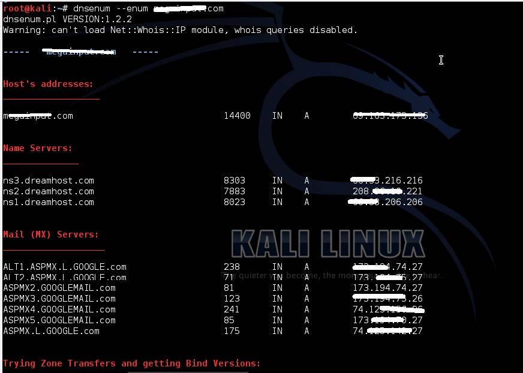

# 第四章 信息收集

## 简介

攻击的重要阶段之一就是信息收集。为了能够实施攻击，我们需要收集关于目标的基本信息。我们获得的信息越多，攻击成功的概率就越高。

我也强调这一阶段的一个重要方面，它就是记录。在编写这本书的时候，最新的Kali发行版包含了一组工具用于帮助我们核对和组织来自目标的数据，允许我们更好地侦查目标。类似Maltego CaseFile和 KeepNote的工具就是一个例子。

## 4.1 服务枚举

在这个秘籍中，我们将会展示一些服务枚举的小技巧。枚举是允许我们从网络收集信息的过程。我们将要研究DNS枚举和SNMP枚举技术。DNS枚举是定位某个组织的所有DNS服务器和DNS条目的过程。DN枚举允许我们收集有关该组织的重要信息，例如用户名、计算机名称、IP地址以及其它。为了完成这些任务我们会使用DNSenum。对于SNMP枚举，我们会使用叫做SnmpEnum的工具，它是一个强大的SNMP枚举工具，允许我们分析网络上的SNMP流量。

### 操作步骤

让我们以DNS枚举作为开始：

1.  我们使用DNSenum进行DNS枚举。为了开始DNS枚举，打开Gnome终端，并且输入一下命令：

    ```
    cd /usr/bin
    ./dnsenum --enum adomainnameontheinternet.com
    ```

    > 请不要在不属于你的公共网站或者不是你自己的服务器上运行这个工具。这里我们将`adomainnameontheinternet.com`作为一个例子，你应该替换掉这个目标。要当心！

2.  我们需要获取信息输出，例如主机、名称服务器、邮件服务器，如果幸运的话还可以得到区域转换：

    

3.  我们可以使用一些额外的选项来运行DNSenum，它们包括这些东西：

    + `-- threads [number]`允许你设置一次所运行的线程数量。
    + `-r`允许你开启递归查找。
    + `-d`允许你设置在WHOIS请求之间的时间延迟，单位为秒。
    + `-o`允许我们制定输出位置。
    + `-w`允许我们开启WHOIS查询。

    > 更多WHOIS上的例子，请见[WHOIS的维基百科](http://en.wikipedia.org/wiki/Whois)。

4.  我们可以使用另一个命令`snmpwalk`来检测Windows主机。Snmpwalk是一个使用SNMP GETNEXT请求在网络实体中查询信息树的SNMP应用。在命令行中键入下列命令：

    ```
    snmpwalk -c public 192.168.10.200 -v 2c
    ```

5.  我们也可以枚举安装的软件：

    ```
    snmpwalk -c public 192.168.10.200 -v 1 | grep  hrSWInstalledName

    HOST-RESOURCES-MIB::hrSWInstalledName.1 = STRING: "VMware  Tools" 
    HOST-RESOURCES-MIB::hrSWInstalledName.2 = STRING: "WebFldrs"
    ```

6.  以及使用相同工具枚举开放的TCP端口：

    ```
    snmpwalk -c public 192.168.10.200 -v 1 | grep tcpConnState |  cut -d"." -f6 | sort –nu

    21
    25
    80
    443
    ```

7.  另一个通过SNMP收集信息的工具叫做`snmpcheck`：

    ```
    cd /usr/bin
    snmpcheck -t 192.168.10.200
    ```

8.  为了使用fierce（一个尝试多种技术来寻找所有目标所用的IP地址和域名的工具）进行域名扫描，我们可以键入以下命令：

    ```
    cd /usr/bin
    fierce -dns adomainnameontheinternet.com
    ```

    > 请不要在不属于你的公共网站或者不是你自己的服务器上运行这个工具。这里我们将`adomainnameontheinternet.com`作为一个例子，你应该替换掉这个目标。要当心！

9.  为了以指定的词语列表进行相同的操作，键入以下命令：

    ```
    fierce -dns adomainnameontheinternet.com -wordlist  hosts.txt -file /tmp/output.txt
    ```

0.  为了在SMTP服务器上启动用户的SMTP枚举，键入以下命令：

    ```
    smtp-user-enum -M VRFY -U /tmp/users.txt -t 192.168.10.200
    ```

1.  我们现在可以记录所获得的结果了。

## 4.2 判断网络范围

使用上一节中我们所收集的信息，我们就能着眼于判断目标网络的IP地址范围。在这个秘籍中我们将要探索完成它所用的工具。

### 操作步骤

让我们通过打开终端窗口来开始执行判断网络范围的步骤：

1.  打开新的终端窗口，并且键入以下命令：

    ```
    dmitry -wnspb targethost.com -o /root/Desktop/dmitry-result
    ```
    
2.  完成之后，我们应该在桌面上得到了一个文本文件，名称为`dmitry-result.txt`，含有收集到的目标信息：

    
    
3.  键入以下命令来执行ICMP netmask请求：

    ```
    netmask -s targethost.com
    ```
    
4.  使用scapy，我们就可以执行并行路由跟踪。键入以下命令来启动它：

    ```
    scapy
    ```
    
5.  scapy启动之后，我们现在可以输入以下函数：

    ```
    ans,unans=sr(IP(dst="www.targethost.com/30", ttl=(1,6))/TCP()
    ```
    
6.  我们可以输入以下函数来将结果展示为表格：

    ```
    ans.make_table( lambda (s,r): (s.dst, s.ttl, r.src) )
    ```
    
    结果如下：
    
    ```
    216.27.130.162  216.27.130.163  216.27.130.164 216.27.130.165  
    1 192.168.10.1   192.168.10.1    192.168.10.1   192.168.10.1     
    2 51.37.219.254  51.37.219.254   51.37.219.254  51.37.219.254   
    3 223.243.4.254  223.243.4.254   223.243.4.254  223.243.4.254   
    4 223.243.2.6    223.243.2.6     223.243.2.6    223.243.2.6     
    5 192.251.254.1  192.251.251.80  192.251.254.1  192.251.251.80
    ```
    
7.  我们需要键入以下函数来使用scapy获得TCP路由踪迹：

    ```
    res,unans=traceroute(["www.google.com","www.Kali- linux.org","www.targethost.com"],dport=[80,443],maxttl=20, retry=-2) 
    ```
    
8.  我们只需要键入以下函数来将结果展示为图片：

    ```
    res.graph()
    ```
    
    
    
9.  保存图片只需要下列命令：

    ```
    res.graph(target="> /tmp/graph.svg")
    ```
    
0.  我们可以生成3D展示的图片，通过键入下列函数来实现：

    ```
    res.trace3D()
    ```
    
1.  键入以下命令来退出scapy：

    ```
    exit() 
    ```
    
2.  在获得结果之后，我们现在可以对其做记录。

### 工作原理

在步骤1中，我们使用了`dmitry`来获取目标信息。参数`-wnspub`允许我们在域名上执行WHOIS查询，检索`Netcraft.com`的信息，搜索可能的子域名，以及扫描TCP端口。选项`-o`允许我们将结果保存到文本文件中。在步骤3中，我们建立了一个简单的ICMP netmask请求，带有`-s`选项，来输出IP地址和子网掩码。接下来，我们使用scapy来执行目标上的并行路由跟踪，并在表格中展示结果。在步骤7中，我们在不同主机的80和443端口上执行了TCP路由跟踪，并且将最大TTL设置为20来停止这个过程。在获得结果之后，我们创建了它的图片表示，将它保存到临时目录中，同时创建了相同结果的3D表示。最后，我们退出了scapy。
