# 第五章 漏洞评估

> 作者：Willie L. Pritchett, David De Smet

> 译者：[飞龙](https://github.com/)

> 协议：[CC BY-NC-SA 4.0](http://creativecommons.org/licenses/by-nc-sa/4.0/)

## 简介

扫描和识别目标的漏洞通常被渗透测试者看做无聊的任务之一。但是，它也是最重要的任务之一。这也应该被当做为你的家庭作业。就像在学校那样，家庭作业和小测验的设计目的是让你熟练通过考试。

漏洞识别需要你做一些作业。你会了解到目标上什么漏洞更易于利用，便于你发送威力更大的攻击。本质上，如果攻击者本身就是考试，那么漏洞识别就是你准备的机会。

Nessus 和 OpenVAS 都可以扫描出目标上相似的漏洞。这些漏洞包括：

+ Linux 漏洞
+ Windows 漏洞
+ 本地安全检查
+ 网络服务漏洞

## 5.1 安装、配置和启动 Nessus

在这个秘籍中，我们会安装、配置和启动 Nessus。为了在我们所选的目标上定位漏洞，Nessus 的漏洞检测有两种版本：家庭版和专业版。

+ 家庭版：家庭版用于非商业/个人用途。以任何原因在专业环境下适用 Nessus 都需要使用专业版。
+ 上夜班：专业版用于商业用途。它包括支持和额外特性，例如无线的并发连接数，以及其它。如果你是一个顾问，需要对某个客户执行测试，专业版就是为你准备的。

对于我们的秘籍，我们假定你使用家庭版。

### 准备

需要满足下列需求：

+ 需要网络连接来完成这个秘籍。
+ Nessus 家庭版的有效许可证。

### 操作步骤

让我们开始安装、配置和启动 Nessus， 首先打开终端窗口：

1.  打开 Web 浏览器，访问这个网址：<http://www. tenable.com/products/nessus/select-your-operating-system>。

2.  在屏幕的左侧，`Download Nessus`的下面，选择`Linux`并且选择`Nessus-5.2.1-debian6_amd64.deb`（或新版本）。

    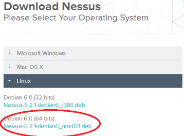

3.  将文件下载到本地根目录下。

    
    
4.  打开终端窗口

5.  执行下列命令来安装 Nessus：

    ```
    dpkg -i "Nessus-5.2.1-debian6_i386.deb" 
    ```
    
    这个命令的输出展示在下面：
    
    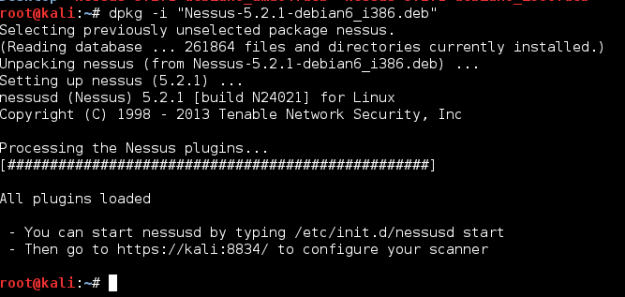
    
6.  Nessus 会安装到`/opt/nessus`目录下。

7.  一旦安装好了，你就能通过键入下列命令启动 Nessus：

    ```
    /etc/init.d/nessusd start
    ```
    
    > 在你启动 Nessus 之前，你需要先拥有注册码。你可以从“更多”一节中得到更多信息。
    
8.  通过执行下列命令，激活你的 Nessus：

    ```
    /opt/nessus/bin/nessus-fetch --register XXXX-XXXX-XXXX-XXXX- XXXX
    ```
    
    这一步中，我们会从<http://plugins.nessus.org>获取新的插件。
    
    > 取决于你的网络连接，这可能需要一到两分钟。
    
9.  现在在终端中键入下列命令：

    ```
    /opt/nessus/sbin/nessus-adduser
    ```
    
0.  在登录提示框中，输入用户的登录名称。

1.  输入两次密码。

2.  回答 Y（Yes），将用户设置为管理员。

    > 这一步只需要在第一次使用时操作。
    
3.  完成后，你可以通过键入以下命令来启动 Nessus（没有用户账户则不能工作）。

4.  在<https://127.0.0.1:8834>上登录 Nessus。

    > 如果你打算使用 Nessus，要记得从安装在你的主机上 ，或者虚拟机上的kali Linux 版本中访问。原因是，Nessus会基于所使用的机器来激活自己。如果你安装到优盘上了，在每次重启后你都需要重新激活你的版本。
    
### 工作原理

在这个秘籍中，我们以打开终端窗口，并通过仓库来安装 Nessus 开始。之后我们启动了 Nessus，并为了使用它安装了我们的证书。

### 更多

为了注册我们的 Nessus 副本，你必须拥有有效的许可证，它可以从<http://www.tenable.com/products/nessus/nessus-homefeed>获取。而且，Nessus 运行为浏览器中的 Flash，所以首次启动程序时，你必须为 Firefox 安装 Flash 插件。如果你在使用 Flash 时遇到了问题，访问<www.get.adobe.com/flashplayer>来获得信息。

## 5.2 Nessus - 发现本地漏洞

现在我们已经安装并配置了 Nessus，我们将要执行第一次漏洞测试。Nessus 允许我们攻击很多种类的漏洞，它们取决于我们的版本。我们也需要评估的目标漏洞列表限制为针对我们想要获取的信息类型的漏洞。在这个秘籍中，我们将要以发现本地漏洞开始，这些漏洞针对我们当前使用的操作系统。

### 准备

为了完成这个秘籍，你将要测试你的本地系统（Kali Linux）。

### 操作步骤

让我们开始使用 Nessus 来发现本地漏洞，首先打开 Firefox 浏览器：

1.  在 <https://127.0.0.1:8834> 登录 Nessus。

2.  访问` Policies`。

3.  点击`New Policy`。

    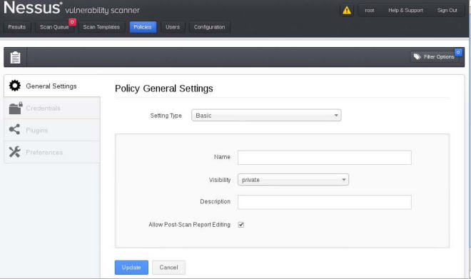
    
4.  在`General Settings`标签页，进行如下操作：

    1.  在` Settings Type`中选择` Basic`。
    
    2.  为你的扫描输入一个名称。我们选择了`Local Vulnerability Assessment`，但你可以选择想要的其它名称。
    
    3.  有两个可见性的选择：‘
    
        +   `Shared`：其它用户可以利用这次扫描。
        
        +   `Private`：这次扫描只能被你使用。
        
    4.  其它项目保留默认。
    
    5.  点击`Update`。
    
5.  在`Plugins`标签页中，选择`Disable All`并选择下列特定的漏洞：

    1.  `Ubuntu Local Security Checks `。
    
    2.  ` Default Unix Accounts`。
    
    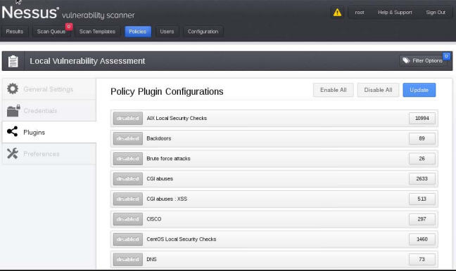
    
6.  点击`Update`来保存新的策略。

7.  在主菜单中，点击`Scan Queue`菜单选项。

8.  点击`New Scan`按钮并进行如下操作：

    1.  为你的扫描输入名称。如果你一次运行多个扫描，这会非常有用。这是区分当前运行的不同扫描的方式。
    
    2.  输入扫描类型：
    
        +   `Run Now`：默认开启，这个选项会立即运行扫描。
        
        +   `Scehduled`：允许你选择日期和时间来运行扫描。
        
        +   `Template`：将扫描设置为模板。
        
    3.  选择扫描策略。这里，我们选择之前创建的`Local Vulnerabilities Assessment`策略。
    
    4.  选择你的目标，包含下列要点：
    
        +   目标必须每行输入一个。
        
        +   你也可以在每行输入目标的范围。
        
    5.  你也可以上传目标文件（如果有的话）或选择` Add Target  IP Address`。
    
9.  点击`Run Scan`：

    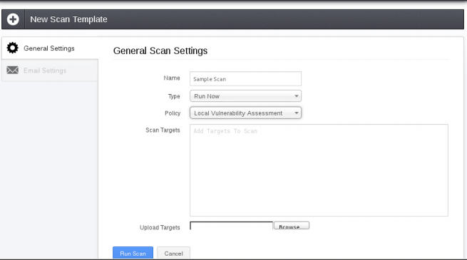
    
0.  你会被要求确认，你的测试将会执行（取决于你选择了多少目标，以及要执行多少测试）。

1.  一旦完成了，你会收到一份报告。

2.  双击报告来分析下列要点（在`Results`标签页中）：
    
    +   每个发现了漏洞的目标会被列出。
    
    +   双击 IP 地址来观察端口，和每个端口的问题。
    
    +   点击列下方的数字，来获得所发现的特定漏洞的列表。
    
    +   漏洞会详细列出。
    
3.  点击`Reports`主菜单中的` Download Report `。

## 5.3 Nessus -  发现网络漏洞

Nessus 允许我们攻击很多种类的漏洞，它们取决于我们的版本。我们也需要评估的目标漏洞列表限制为针对我们想要获取的信息类型的漏洞。这个密集中，我们会配置 Nessus 来发现目标上的网络漏洞。这些漏洞针对主机或网络协议。

### 准备

为了完成这个秘籍，你需要被测试的虚拟机。

+ Windows XP 
+ Windows 7 
+ Metasploitable 2.0 
+ 网络防火墙或路由
+ 任何其它 Linux 版本

### 操作步骤

让我们开始使用 Nessus 来发现本地漏洞，首先打开 Firefox 浏览器：

1.  在 <https://127.0.0.1:8834> 登录 Nessus。

2.  访问` Policies`。

3.  点击`Add Policy`。

    
    
4.  在`General`标签页，进行如下操作：
    
    1.  为你的扫描输入一个名称。我们选择了`Internal Network Scan`，但你可以选择想要的其它名称。
    
    2.  有两个可见性的选择：‘
    
        +   `Shared`：其它用户可以利用这次扫描。
        
        +   `Private`：这次扫描只能被你使用。
        
    3.  其它项目保留默认。
    
    4.  点击`Update`。
    
5.  在`Plugins`标签页中，点击` Disable All `并选择下列特定的漏洞：
    
    +   `CISCO`     
    +   `DNS`     
    +   `Default Unix Accounts`     
    +   `FTP`     
    +   `Firewalls`     
    +   `Gain a shell remotely`     
    +   `General`     
    +   `Netware`     
    +   `Peer-To-Peer File Sharing`     
    +   `Policy Compliance`     
    +   `Port Scanners`     
    +   `SCADA`     
    +   `SMTP Problems`     
    +   `SNMP`     
    +   `Service Detection`     
    +   `Settings`
    
    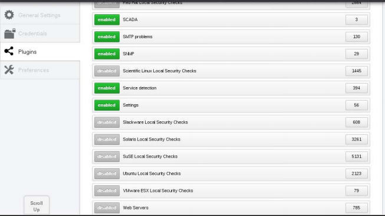

6.  点击`Update`来保存新的策略。

7.  在主菜单中，点击`Scan Queue`菜单选项。

8.  点击`New Scan`按钮并进行如下操作：

    1.  为你的扫描输入名称。如果你一次运行多个扫描，这会非常有用。这是区分当前运行的不同扫描的方式。
    
    2.  输入扫描类型：
    
        +   `Run Now`：默认开启，这个选项会立即运行扫描。
        
        +   `Scehduled`：允许你选择日期和时间来运行扫描。
        
        +   `Template`：将扫描设置为模板。
        
    3.  选择扫描策略。这里，我们选择之前创建的`Internal Network Scan`策略。
    
    4.  选择你的目标，包含下列要点：
    
        +   目标必须每行输入一个。
        
        +   你也可以在每行输入目标的范围。
        
    5.  你也可以上传目标文件（如果有的话）或选择` Add Target  IP Address`。
    
9.  点击`Run Scan`：

    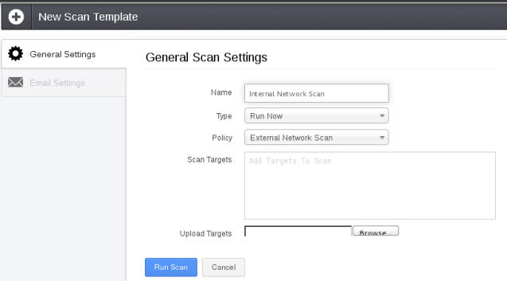

0.  你会被要求确认，你的测试将会执行（取决于你选择了多少目标，以及要执行多少测试）。

    

1.  一旦完成了，你会收到一份报告，它在`Results`标签页中。

2.  双击报告来分析下列要点（在`Results`标签页中）：
    
    +   每个发现了漏洞的目标会被列出。
    
    +   双击 IP 地址来观察端口，和每个端口的问题。
    
    +   点击列下方的数字，来获得所发现的特定问题/漏洞的列表。
    
    +   漏洞会详细列出。
    
3.  点击`Reports`主菜单中的` Download Report `。

## 5.4 发现 Linux 特定漏洞

在这个秘籍中，我们会使用 Nessus 探索如何发现 Linux 特定漏洞。这些漏洞针对网络上运行Linux的主机。

### 准备

为了完成这个秘籍，你需要被测试的虚拟机：

+  Metasploitable 2.0 
+  其它 Linux 版本

### 操作步骤

让我们开始使用 Nessus 来发现 Linux 特定漏洞，首先打开 Firefox 浏览器：

1.  在 <https://127.0.0.1:8834> 登录 Nessus。

2.  访问` Policies`。

3.  点击`Add Policy`。

    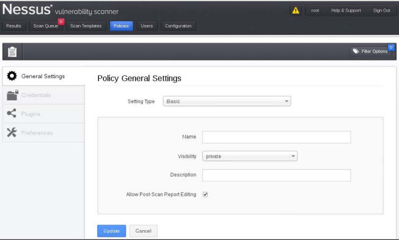
    
4.  在`General Settings `标签页，进行如下操作：
    
    1.  为你的扫描输入一个名称。我们选择了`Linux Vulnerability Scan`，但你可以选择想要的其它名称。
    
    2.  有两个可见性的选择：‘
    
        +   `Shared`：其它用户可以利用这次扫描。
        
        +   `Private`：这次扫描只能被你使用。
        
    3.  其它项目保留默认。
    
5.  在`Plugins`标签页中，点击` Disable All `并选择下列特定的漏洞。当我们扫描可能在我们的 Linux 目标上运行的服务时，这份列表会变得很长：
    
    +   `Backdoors`
    +   `Brute Force Attacks`
    +   `CentOS Local Security Checks`
    +   `DNS` ‰ 
    +   `Debian Local Security Checks` ‰ 
    +   `Default Unix Accounts` ‰ 
    +   `Denial of Service` ‰ 
    +   `FTP` ‰ 
    +   `Fedora Local Security Checks` ‰ 
    +   `Firewalls` ‰ 
    +   `FreeBSD Local Security Checks` ‰ 
    +   `Gain a shell remotely` ‰ 
    +   `General` ‰ 
    +   `Gentoo Local Security Checks` ‰ 
    +   `HP-UX Local Security Checks` ‰ 
    +   `Mandriva Local Security Checks` ‰ 
    +   `Misc` ‰ 
    +   `Port Scanners` ‰ 
    +   `Red Hat Local Security Checks` ‰ 
    +   `SMTP Problems` ‰ 
    +   `SNMP` ‰ 
    +   `Scientific Linux Local Security Checks` ‰ 
    +   `Slackware Local Security Checks` ‰ 
    +   `Solaris Local Security Checks`
    +   `SuSE Local Security Checks` ‰ 
    +   `Ubuntu Local Security Checks` ‰ 
    +   `Web Servers`
    
    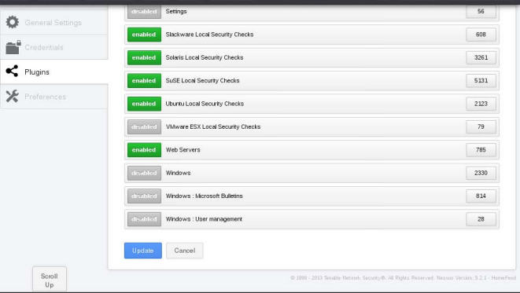

6.  点击`Update`来保存新的策略。

7.  在主菜单中，点击`Scan Queue`菜单选项。

8.  点击`New Scan`按钮并进行如下操作：

    1.  为你的扫描输入名称。如果你一次运行多个扫描，这会非常有用。这是区分当前运行的不同扫描的方式。
    
    2.  输入扫描类型：
    
        +   `Run Now`：默认开启，这个选项会立即运行扫描。
        
        +   `Scehduled`：允许你选择日期和时间来运行扫描。
        
        +   `Template`：将扫描设置为模板。
        
    3.  选择扫描策略。这里，我们选择之前创建的`Linux Vulnerabilities Scan`策略。
    
    4.  选择你的目标，包含下列要点：
    
        +   目标必须每行输入一个。
        
        +   你也可以在每行输入目标的范围。
        
        +   上传目标文件（如果有的话）或选择` Add Target  IP Address`。
    
9.  点击`Launch Scan`：

    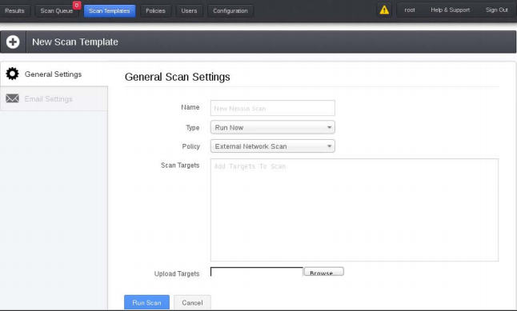

0.  你会被要求确认，你的测试将会执行（取决于你选择了多少目标，以及要执行多少测试）。

    

1.  一旦完成了，你会收到一份报告，它在 `Reports`标签页中。

2.  双击报告来分析下列要点：
    
    +   每个发现了漏洞的目标会被列出。
    
    +   双击 IP 地址来观察端口，和每个端口的问题。
    
    +   点击列下方的数字，来获得所发现的特定问题/漏洞的列表。
    
    +   漏洞会详细列出。
    
3.  点击`Reports`主菜单中的` Download Report `。

## 5.5 Nessus - 发现 Windows 特定的漏洞

在这个秘籍中，我们会使用 Nessus 探索如何发现 Windows 特定漏洞。这些漏洞针对网络上运行 Windows 的主机。

### 准备

为了完成秘籍，你需要被测试的虚拟机：

+ Windows XP
+ Windows 7

### 操作步骤

让我们开始使用 Nessus 发现 Windows 特定的漏洞，首先打开 Firefox 浏览器：

1.  在 <https://127.0.0.1:8834> 登录 Nessus。

2.  访问` Policies`。

3.  点击`Add Policy`。

    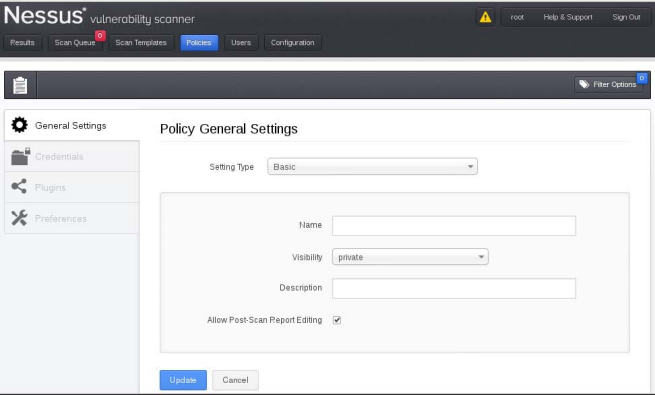
    
4.  在`General Settings `标签页，进行如下操作：
    
    1.  为你的扫描输入一个名称。我们选择了` Windows Vulnerability Scan`，但你可以选择想要的其它名称。
    
    2.  有两个可见性的选择：‘
    
        +   `Shared`：其它用户可以利用这次扫描。
        
        +   `Private`：这次扫描只能被你使用。
        
    3.  其它项目保留默认。

    4.  点击`Submit`。
    
5.  在`Plugins`标签页中，点击` Disable All `并选择下列特定的漏洞。它们可能出现在 Windows 系统中：
    
    +   DNS ‰ Databases ‰ 
    +   Denial of Service ‰ 
    +   FTP ‰ 
    +   SMTP Problems ‰ 
    +   SNMP ‰ Settings ‰ 
    +   Web Servers ‰ 
    +   Windows ‰ 
    +   Windows: Microsoft Bulletins ‰ 
    +   Windows: User management
    
    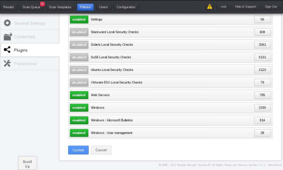

6.  点击`Submit`来保存新的策略。

7.  在主菜单中，点击`Scan`菜单选项。

8.  点击`Add Scan`按钮并进行如下操作：

    1.  为你的扫描输入名称。如果你一次运行多个扫描，这会非常有用。这是区分当前运行的不同扫描的方式。
    
    2.  输入扫描类型：
    
        +   `Run Now`：默认开启，这个选项会立即运行扫描。
        
        +   `Scehduled`：允许你选择日期和时间来运行扫描。
        
        +   `Template`：将扫描设置为模板。
        
    3.  选择扫描策略。这里，我们选择之前创建的`Windows Vulnerabilities Scan`策略。
    
    4.  选择你的目标，包含下列要点：
    
        +   目标必须每行输入一个。
        
        +   你也可以在每行输入目标的范围。
        
        +   上传目标文件（如果有的话）或选择` Add Target  IP Address`。
    
9.  点击`Launch Scan`：

    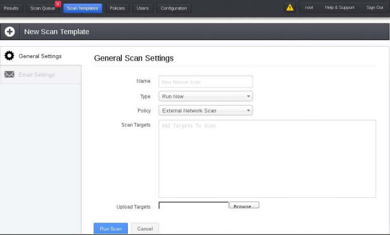

0.  你会被要求确认，你的测试将会执行（取决于你选择了多少目标，以及要执行多少测试）。

    

1.  一旦完成了，你会收到一份报告，它在 `Reports`标签页中。

2.  双击报告来分析下列要点：
    
    +   每个发现了漏洞的目标会被列出。
    
    +   双击 IP 地址来观察端口，和每个端口的问题。
    
    +   点击列下方的数字，来获得所发现的特定问题/漏洞的列表。
    
    +   漏洞会详细列出。
    
3.  点击`Reports`主菜单中的` Download Report `。

