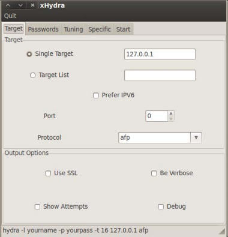
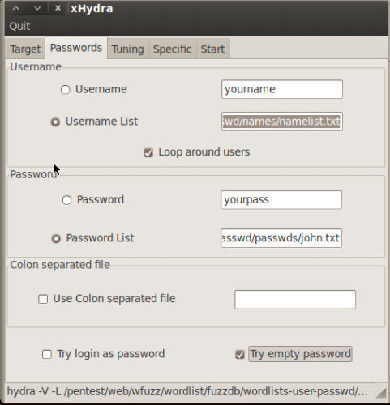
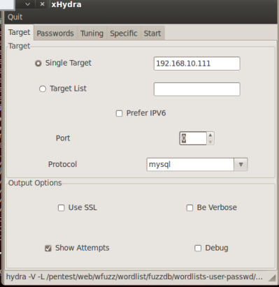
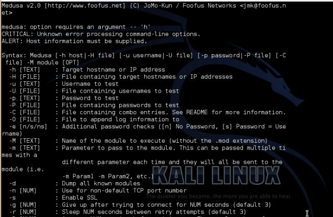

# 第八章 密码攻击

> 作者：Willie L. Pritchett, David De Smet

> 译者：[飞龙](https://github.com/)

> 协议：[CC BY-NC-SA 4.0](http://creativecommons.org/licenses/by-nc-sa/4.0/)

这一章中，我们要探索一些攻击密码来获得用户账户的方式。密码破解是所有渗透测试者都需要执行的任务。本质上，任何系统的最不安全的部分就是由用户提交的密码。无论密码策略如何，人们必然讨厌输入强密码，或者时常更新它们。这会使它们易于成为黑客的目标。

## 8.1 在线密码攻击

这个秘籍中我们会使用 Hydra 密码破解器。有时候我们有机会来物理攻击基于 Windows 的计算机，直接获取安全账户管理器（SAM）。但是，我们也有时不能这样做，所以这是在线密码攻击具有优势的情况。

Hydra 支持许多协议，包括（但不仅限于）FTP、HTTP、HTTPS、MySQL、MSSQL、Oracle、Cisco、IMAP、VNC 和更多的协议。需要注意的是，由于这种攻击可能会产生噪声，这会增加你被侦测到的可能。

### 准备

需要内部网络或互联网的链接，也需要一台用作受害者的计算机。

### 操作步骤

让我们开始破解在线密码。

1.  在开始菜单中，选择` Applications | Kali Linux | Password Attacks | Online Attacks | hydra-gtk`。

    
    
2.  既然我们已经把 Hydra 打开了，我们需要设置我们的单词列表。点击`Passwords`（密码）标签页。我们需要使用用户名列表和密码列表。输入你的用户名和密码列表的位置。同时选择` Loop around users `（循环使用用户名）和` Try  empty password`（尝试空密码）。

    +   用户名列表：`/usr/share/wfuzz/wordlist/fuzzdb/wordlistsuser-passwd/names/nameslist.txt`
    +   密码列表：`/usr/share/wfuzz/wordlist/fuzzdb/wordlistsuser-passwd/passwds/john.txt`
    
    > 你可以使用的快捷方式是，点击单词列表框来打开文件系统窗口。
    
    
    
3.  下面，我们要做一些调整。在`Performance Options`（执行选项）下面，我们将任务数量从 16 设置为 2。原因是我们不打算让这么多进程运行，这样会使服务器崩溃。虽然它是可选的，我们也希望选择`Exit after first found pair `（在首次发现匹配之后退出）选项。

    
    
4.  最后，我们要设置我们的目标。点击`Target`（目标）标签页并设置我们的目标和协议。这里，我们使用 Metasploitable 主机（`192.168.10.111`）的 MySQL 端口。

    

5.  最后我们点击`Start`（开始）标签页的`Start`按钮来启动攻击。

    
    
### 工作原理

这个秘籍中，我们使用 Hydra 来对目标执行字典攻击。Hydra 允许我们指定目标，并且使用用户名和密码列表。它会通过使用来自两个列表的不同用户名和密码组合来爆破密码。

## 8.2 破解 HTTP 密码

这个秘籍中，我们将要使用 Hydra 密码破解器来破解 HTTP 密码。网站和 Web 应用的访问通常由用户名和密码组合来控制。就像任何密码类型那样，用户通常会输入弱密码。

### 准备

需要内部网络或互联网的链接，也需要一台用作受害者的计算机。

### 操作步骤

让我们开始破解 HTTP 密码。

1.  在开始菜单中，选择` Applications | Kali Linux | Password Attacks | Online Attacks | hydra-gtk`。

    
    
2.  既然我们已经把 Hydra 打开了，我们需要设置我们的单词列表。点击`Passwords`（密码）标签页。我们需要使用用户名列表和密码列表。输入你的用户名和密码列表的位置。同时选择` Loop around users `（循环使用用户名）和` Try  empty password`（尝试空密码）。

    +   用户名列表：`/usr/share/wfuzz/wordlist/fuzzdb/wordlistsuser-passwd/names/nameslist.txt`
    +   密码列表：`/usr/share/wfuzz/wordlist/fuzzdb/wordlistsuser-passwd/passwds/john.txt`
    
    > 你可以使用的快捷方式是，点击单词列表框来打开文件系统窗口。
    
    
    
3.  下面，我们要做一些调整。在`Performance Options`（执行选项）下面，我们将任务数量从 16 设置为 2。原因是我们不打算让这么多进程运行，这样会使服务器崩溃。虽然它是可选的，我们也希望选择`Exit after first found pair `（在首次发现匹配之后退出）选项。

    
    
4.  最后，我们要设置我们的目标。点击`Target`（目标）标签页并设置我们的目标和协议。这里，我们使用 Metasploitable 主机（`192.168.10.111`）的 HTTP 端口。

    

5.  最后我们点击`Start`（开始）标签页的`Start`按钮来启动攻击。

    

## 8.3 获得路由访问

这个秘籍中，我们会使用 Medusa 来进行爆破攻击。

当今，我们处于网络社会之中。随着联网视频游戏系统的诞生，多数家庭拥有数台计算机，并且小型业务以创纪录的趋势增长。路由器也成为了网络连接的基石。然而，富有经验的网络管理员的数量并没有增长，以保护这些路由器，使得许多这种路由器易于被攻击。

### 准备

需要连接到互联网或内部网络的计算机。也需要可用的路由器。

### 操作步骤

1.  在开始菜单中，访问` Applications | Kali Linux | Password Attacks | Online Attacks | medusa`。当 Medusa 启动后，它会加载`help`（帮助）文件。

    

2.  我们现在已选定的选项来云顶 Medusa。

    ```
    medusa –M http -h 192.168.10.1 -u admin -P /usr/share/wfuzz/ wordlist/fuzzdb/wordlists-user-passwd/passwds/john.txt -e ns -n 80 -F
    ```
    
    +   `-M http`允许我们指定模块。这里，我们选择了 HTTP 模块。
    
    +   `-h 192.168.10.1`允许我们指定主机。这里，我们选择了`192.168.10.1`（路由的 IP 地址）。
    
    +   `-u admin`允许我们指定用户。这里我们选择了`admin`。
    
    +   `-P [location of password list]`允许我们指定密码列表的位置。
    
    +   `-e ns`允许我们指定额外的密码检查。`ns`变量允许我们使用用户名作为密码，并且使用空密码。
    
    +   `-n 80`允许我们指定端口号码。这里我们选择了`80`。
    
    +   `-F`允许我们在成功找到用户名密码组合之后停止爆破。
    
    
    
3.  Medusa 会运行，并尝试所有用户名和密码组合，直到某次成功。

### 工作原理

这个秘籍中，我们使用 Medusa 来爆破目标路由器的密码。能够这样做的好处就是，一旦你能够访问路由器，你就可以更新它的设置，便于你以后再访问它，或者甚至是重定向发送给它的流量来改变你选择的位置。

### 更多

你也可以直接从命令行运行 Medusa，通过键入`medusa`命令。

你也可以传入其它选项给 Medusa，取决于你的情况。细节请参见帮助文档，通过在终端窗口仅仅键入`medusa`来显示。

**模块类型**

下面是我们可以用于 Medusa 的模块列表：

+ AFP
+ CVS
+ FTP
+ HTTP
+ IMAP
+ MS-SQL
+ MySQL
+ NetWare
+ NNTP
+ PCAnywhere
+ Pop3
+ PostgreSQL
+ REXEC
+ RLOGIN
+ RSH
+ SMBNT
+ SMTP-AUTH
+ SMTp-VRFY
+ SNMP
+ SSHv2
+ Subversion
+ Telnet
+ VMware Authentication
+ VNC
+ Generic Wrapper
+ Web form
